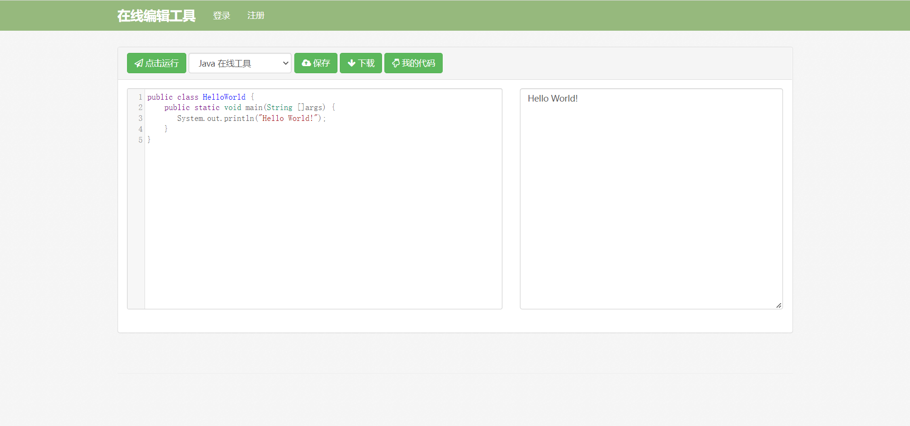
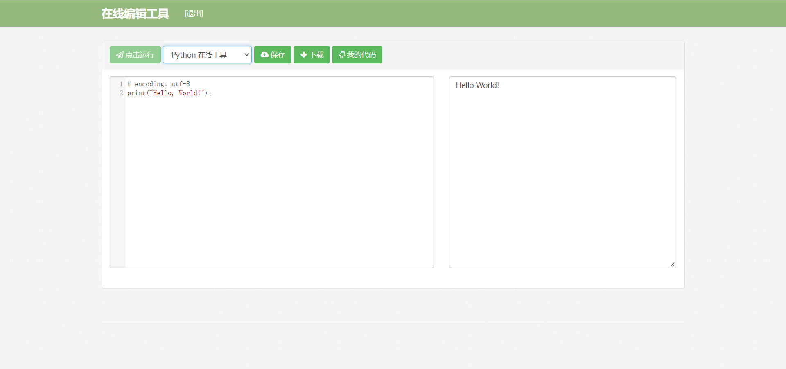
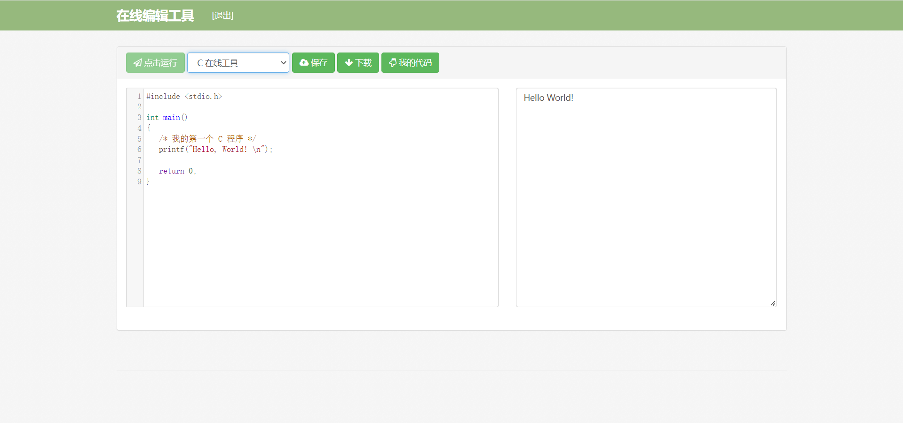
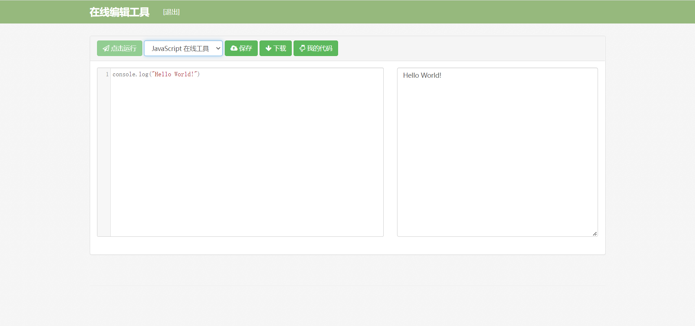
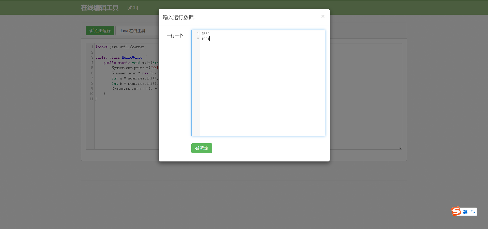
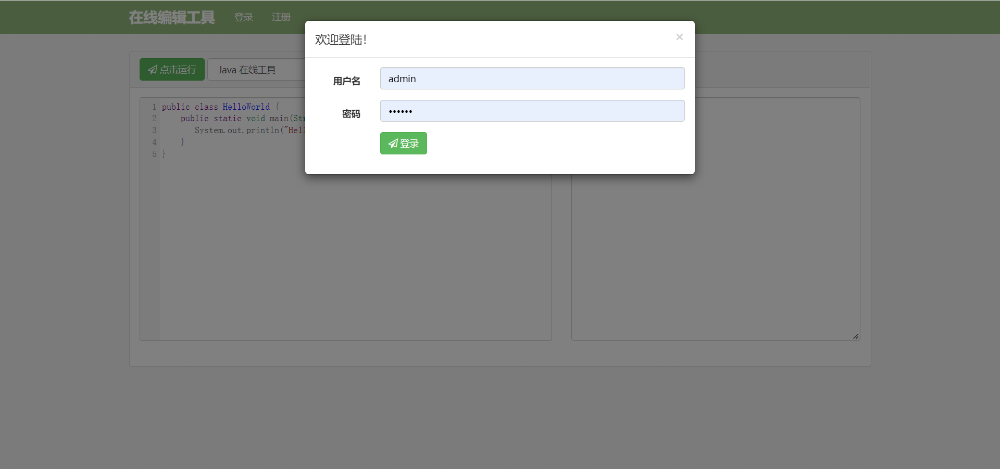
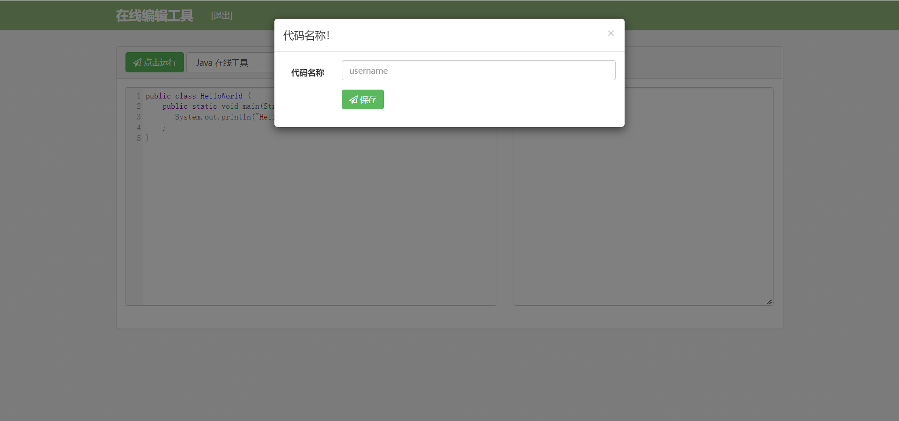
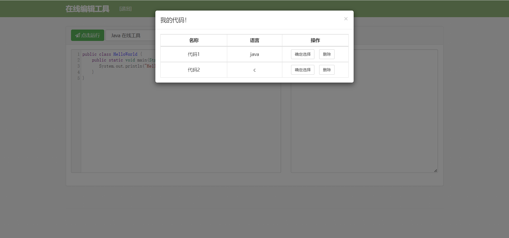

# WEB在线编程系统

#### 介绍
WEB在线编程系统，实现用户登录注册、在线网页代码的编辑（支持代码高亮）、代码在线运行（支持Java、C、Python、JavaScript等）、代码保存与退出功能等。

#### 软件架构
基于Spring Boot、Mybatis Plus的WEB在线编程系统。

#### 演示图

数据交互

注册登录

保存代码

有需要请联系QQ:985561156
